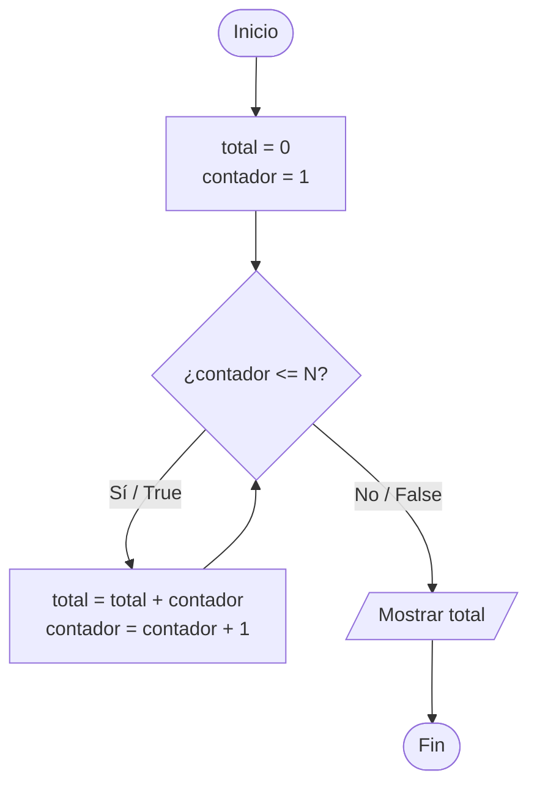

# SOP: Diagramación y Modelos Mentales (Diagramming & Mental Models SOP)

## 1. Objetivo
Proveer directrices estandarizadas para el uso de diagramas visuales (Mermaid) y representaciones gráficas de memoria y control de flujo. Los diagramas son esenciales para que los estudiantes de fundamentos visualicen la ejecución secuencial, las bifurcaciones condicionales, los bucles y las estructuras de datos en memoria.

---

## 2. Tipos de Diagramas Requeridos

### A. Diagramas de Flujo de Control (Flowcharts Mermaid)
Se utilizan para explicar:
- Decisiones condicionales (`if / else / switch`).
- Ciclos repetitivos (`while`, `for`, `do-while`).
- Algoritmos paso a paso (ej. Búsqueda lineal, ordenamiento burbuja).

#### Convenciones de Nodos Mermaid:
- `([Inicio / Fin])`: Nodos terminales (óvalos/cápsulas).
- `[/Entrada o Salida/]`: Lectura con `cin` / `input()`, o impresión con `cout` / `print()` (paralelogramos).
- `[Proceso / Asignación]`: Inicialización de variables, cálculos matemáticos (rectángulos).
- `{"¿Condición?"}`: Bifurcaciones lógicas con ramas `Sí` / `No` o `True` / `False` (rombos).

#### Ejemplo Estándar Mermaid: Bucle `While` con Acumulador


---

### B. Diagramas de Modelo de Memoria y Variables (Stack vs Heap / Referencias)
Especialmente útil para contrastar cómo Python y C++ manejan variables y estructuras en memoria.

#### 1. Modelo en C++ (Variables locales en Stack + Arreglos contiguos):
```text
+-------------------+--------------------+------------------------+
| Nombre Variable   | Tipo               | Dirección / Memoria    | Valor                  |
+-------------------+--------------------+------------------------+
| edad              | int (4 bytes)      | 0x7ffd10               | 20                     |
| promedio          | double (8 bytes)   | 0x7ffd14               | 4.5                    |
| numeros[3]        | int[3] (12 bytes)  | 0x7ffd20 (bloque cont) | [10, 20, 30]           |
| *ptr              | int* (8 bytes)     | 0x7ffd30               | -> apunta a 0x7ffd10   |
+-------------------+--------------------+------------------------+
```

#### 2. Modelo en Python (Variables como etiquetas/referencias a objetos en memoria dinámica):
```text
[Namespace / Variables]              [Memoria de Objetos (Heap)]
     nombre_var --------(referencia)-----> [ Objeto tipo int: 20 ] (id: 140239...)
     mi_lista   --------(referencia)-----> [ Objeto list ]
                                              ├── [0] -> ref a objeto int: 10
                                              ├── [1] -> ref a objeto int: 20
                                              └── [2] -> ref a objeto int: 30
```

---

### C. Tablas de Prueba de Escritorio (Execution Traces)
Toda explicación de bucle o algoritmo debe acompañarse de una traza tabular:

```markdown
| Paso | Línea | Variable `i` | Variable `acumulador` | Condición `i < n` | Salida Pantalla |
| :--- | :--- | :--- | :--- | :--- | :--- |
| 1 | 4 | 0 | 0 | True (0 < 3) | - |
| 2 | 5 | 0 | 10 (0+10) | - | - |
| 3 | 4 | 1 | 10 | True (1 < 3) | - |
| 4 | 5 | 1 | 25 (10+15) | - | - |
| 5 | 4 | 2 | 25 | True (2 < 3) | - |
| 6 | 5 | 2 | 45 (25+20) | - | - |
| 7 | 4 | 3 | 45 | False (3 < 3) | Fin del bucle |
| 8 | 8 | 3 | 45 | - | "Total: 45" |
```
