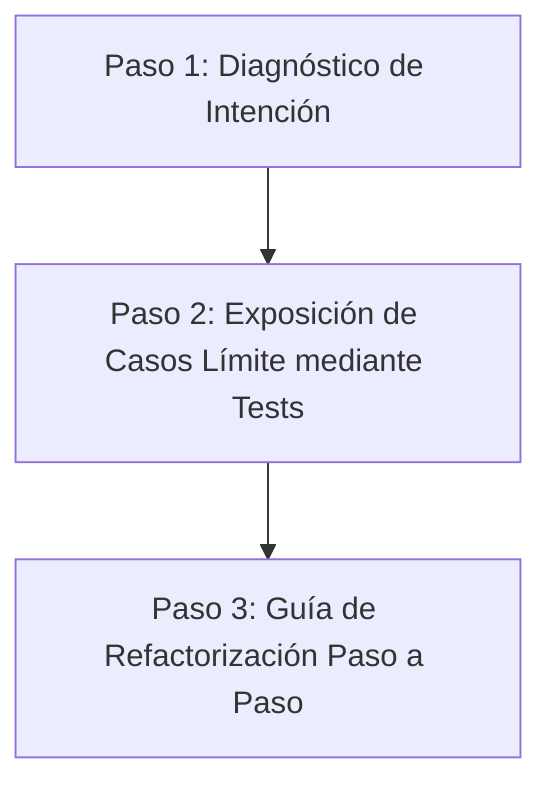

# Informe Técnico: Base de Conocimiento y Directrices de Diseño para Agentes Educadores en Python

Este informe técnico sirve como base de conocimiento para un agente de IA que opere como tutor o guía educativo en el desarrollo de capacidades en Python. Su objetivo es proporcionar un marco conceptual profundo, pragmático e inmune a las falsas asunciones y malas prácticas comunes en la programación de Python. Para lograr la máxima solidez, el contenido se ha sintetizado mediante el uso de **Agentes Adversariales**, enfrentando la teoría pedagógica estándar contra análisis de seguridad, casos de borde y debilidades lógicas.

---

## Estructura de la Base de Conocimiento

El informe está dividido en cinco módulos críticos que todo agente educativo de IA debe dominar para guiar a los estudiantes de manera efectiva:

1. **El Modelo de Datos de Python (Nombres, Valores y Referencias)**
2. **Código Idiomático e Inteligibilidad (Beyond PEP 8)**
3. **Diseño de Software y Principios SOLID Pragmáticos**
4. **Garantía de Calidad y Pruebas Sostenibles**
5. **Directrices Pedagógicas para el Agente Educador (Scaffolding)**

---

## Módulo 1: El Modelo de Datos de Python (Nombres, Valores y Referencias)

### 1.1. Fundamentación Teórica
A diferencia de lenguajes de nivel inferior como C, donde las variables representan cajas físicas o ubicaciones fijas de memoria con un tamaño definido, en Python **las variables son nombres o etiquetas (tags) que apuntan mediante referencias a objetos de datos dinámicos creados en el montón (heap)** [12, 136, 182, 183]. 

La asignación en Python nunca copia datos de manera implícita; simplemente asocia el nombre de la izquierda con el objeto de la derecha [137, 185, 186]. Dos nombres pueden apuntar exactamente al mismo objeto en memoria, lo que se conoce como **aliasing** [61, 137, 183]. La semántica de paso de argumentos a funciones se rige por el modelo de **paso por asignación** o **call-by-sharing** [13, 210]. El comportamiento depende estrictamente de la mutabilidad del objeto recibido [13]:
* **Objetos Inmutables (números, cadenas, tuplas):** Cualquier intento de modificación genera un nuevo objeto en memoria y reasocia la referencia local, emulando un paso por valor [13, 95, 142].
* **Objetos Mutables (listas, diccionarios, conjuntos, objetos de usuario):** Las modificaciones locales dentro de una función alteran directamente el estado interno del objeto en el heap, afectando al llamador de forma inmediata y silenciosa [13, 61, 62, 140, 188].

---

### 1.2. Debate Adversarial: Mutabilidad vs. Inmutabilidad y Fugas de Referencia

* **🤖 Agente_Tutor (Generador):**
  > *"Para enseñar a un estudiante cómo crear una lista y modificarla en una función, podemos mostrarle un código sencillo. Pasar referencias es eficiente y rápido porque Python solo pasa el puntero bajo el capó sin necesidad de duplicar datos [62]. Por ejemplo, una función `agregar_elemento(lista, valor)` simplemente usa `lista.append(valor)`."*

* **👾 Agente_Adversario (Crítico):**
  > *"¡Cuidado! Esa explicación superficial omite el peligro latente del **Mutable Aliasing** [141, 188]. Si el estudiante asigna `nueva_lista = lista_original` pensando que tiene una copia para experimentar, cualquier mutación en `nueva_lista` destruirá los datos de `lista_original` de manera irreversible [140, 187, 188]. Además, el mayor peligro en el diseño de funciones educativas es el uso de **argumentos mutables por defecto** [162]. Si se declara `def registrar_alumno(nombre, historial=[])`, el objeto `list` por defecto se evalúa una sola vez cuando se define la función y queda retenido indefinidamente por el objeto de función [162]. Todos los alumnos subsiguientes compartirán el mismo historial, provocando fugas de información masivas [162]. El agente educativo de IA debe forzar la inmutabilidad o la clonación explícita."*

---

### 1.3. Directrices de Código para el Agente Educador

#### Código Incorrecto (Vulnerable a aliasing y argumentos mutables)
```python
# Anti-patrón: Argumento mutable por defecto y mutación colateral
def registrar_usuario(nombre: str, roles_iniciales: list = []):  # BUG: 'roles_iniciales' se comparte en todas las llamadas [162]
    roles_iniciales.append("usuario")  # Mutación in-place del argumento por defecto [143]
    return {"nombre": nombre, "roles": roles_iniciales}

# Simulación de falla educativa por aliasing incontrolado
datos_admin = ["admin"]
usuario_1 = registrar_usuario("Carlos", roles_iniciales=datos_admin)
usuario_2 = registrar_usuario("Ana")  # Usa el rol por defecto

# Carlos ahora es modificado accidentalmente debido al aliasing
usuario_3 = registrar_usuario("Pedro")  # Pedro hereda los roles acumulados del valor por defecto [162]
```

#### Código Correcto (Pythonic y Seguro)
```python
from typing import List, Optional

# Solución: Evitar argumentos por defecto mutables usando None [162]
# y retornar un nuevo objeto en lugar de mutar el argumento original [156]
def registrar_usuario_seguro(nombre: str, roles_iniciales: Optional[List[str]] = None) -> dict:
    if roles_iniciales is None:
        roles = []
    else:
        # Clonamos explícitamente para evitar efectos secundarios por aliasing externo [140, 188]
        roles = list(roles_iniciales) 
        
    roles.append("usuario")
    return {"nombre": nombre, "roles": roles}
```

---

## Módulo 2: Código Idiomático e Inteligibilidad (Beyond PEP 8)

### 2.1. Fundamentación Teórica
Un error endémico en los equipos de desarrollo y entornos de aprendizaje es asumir ciegamente que la adherencia estética formal a la **PEP 8** garantiza un código legible, robusto y de calidad [8, 17]. Como demostró Raymond Hettinger en *"Beyond PEP 8"*, un cumplimiento obsesivo y superficial de la guía de estilo visual (como ajustar la longitud de línea o el espaciado) puede comprometer gravemente la inteligibilidad y mantenibilidad del software si se descuidan los protocolos de diseño subyacentes [8, 18, 164].

El verdadero código idiomático (*Pythonic*) prioriza la armonía con la naturaleza dinámica de Python y su modelo de datos, en lugar de forzar convenciones de diseño heredadas de otros ecosistemas como Java o C++ [9]. Los pilares de una API legible son:
1. **Atributos Públicos Directos en lugar de Getters/Setters:** En Python es preferible exponer los atributos directamente [9, 229]. Si en el futuro surge la necesidad de introducir validaciones o efectos secundarios en el acceso, el atributo puede transformarse mediante el decorador `@property` sin alterar la API pública ni romper el código de los clientes [9, 19, 229, 245].
2. **Uso de Protocolos y Métodos Mágicos:** Implementar métodos como `__len__` en lugar de `getSize()`, o `__getitem__` en lugar de `getRouteByIndex()`, unifica el comportamiento de los objetos del usuario con las estructuras de datos nativas del lenguaje [10, 245].

---

### 2.2. Debate Adversarial: Formateo Estricto vs. Inteligibilidad Real de la API

* **🤖 Agente_Tutor (Generador):**
  > *"Es fundamental enseñar al estudiante a pasar herramientas de análisis estático como Black y Flake8 de inmediato [2, 20, 300]. El código debe estar perfectamente formateado según la PEP 8 antes de analizar su lógica. Además, para mantener la encapsulación tradicional de la POO, debemos enseñar a ocultar atributos usando nombres con doble guion bajo (como `self.__valor`) y escribir métodos getter/setter tradicionales para cada atributo."*

* **👾 Agente_Adversario (Crítico):**
  > *"Ese enfoque produce programadores de Java que escriben sintaxis de Python rancia. **Black** y **Ruff** son excelentes herramientas para eliminar debates estilísticos en CI/CD [18, 246], pero un código puede cumplir al 100% con PEP 8 y seguir siendo una aberración ilegible [246]. Forzar getters y setters (`get_ip()`) introduce una verbosidad innecesaria [9, 229]. Además, usar el doble guion bajo (`__`) para simular variables privadas activa el "mangling" de nombres (ej. `_Clase__atributo`), lo cual no está diseñado para seguridad sino para evitar colisiones en herencia [65]. Si expones atributos públicos de entrada y usas `@property` solo cuando es necesario, el código se vuelve limpio y flexible [9, 19, 229, 245]. Un agente de IA debe guiar al estudiante a usar protocolos mágicos (`__len__`, `__getitem__`) para que sus clases personalizadas se comporten como colecciones nativas [10, 245]."*

---

### 2.3. Directrices de Código para el Agente Educador

#### Código Incorrecto (Javaesque / No Pythonic)
```python
# Anti-patrón: Encapsulación artificial con getters/setters y nombres de métodos arbitrarios [9, 10, 245]
class TablaRutasAntigua:
    def __init__(self):
        self.__rutas = {}  # Uso de doble guion bajo que activa name mangling innecesario [65]
        
    def get_rutas(self):
        return self.__rutas
        
    def set_rutas(self, nuevas_rutas):
        if not isinstance(nuevas_rutas, dict):
            raise TypeError("Debe ser un diccionario")
        self.__rutas = nuevas_rutas
        
    def obtener_tamano(self):  # Método no idiomático para tamaño [10, 245]
        return len(self.__rutas)
```

#### Código Correcto (Pythonic, Inteligible y Flexible)
```python
from typing import Dict

# Solución: Atributos accesibles de forma directa, uso de @property para validaciones
# e implementación de protocolos del modelo de datos para unificar el comportamiento [9, 10, 245]
class TablaRutasPythonic:
    def __init__(self, rutas_iniciales: Optional[Dict[str, str]] = None) -> None:
        self._rutas = dict(rutas_iniciales) if rutas_iniciales else {}  # Atributo protegido por convención

    @property
    def rutas(self) -> Dict[str, str]:
        """Expone las rutas de manera controlada sin romper la API [9, 19, 229]"""
        return self._rutas

    @rutas.setter
    def rutas(self, nuevas_rutas: Dict[str, str]) -> None:
        if not isinstance(nuevas_rutas, dict):
            raise TypeError("Debe ser un diccionario")
        self._rutas = dict(nuevas_rutas)

    # Métodos mágicos que integran la clase con la sintaxis nativa de Python [10, 245]
    def __len__(self) -> int:
        """Habilita la llamada len(objeto) [10, 245]"""
        return len(self._rutas)

    def __getitem__(self, ip: str) -> str:
        """Habilita el acceso directo por corchetes objeto[ip] [10, 245]"""
        return self._rutas[ip]

    def __repr__(self) -> str:
        """Proporciona una representación clara del objeto para facilitar la depuración [245]"""
        return f"{self.__class__.__name__}({self._rutas!r})"
```

---

## Módulo 3: Diseño de Software y Principios SOLID Pragmáticos

### 3.1. Fundamentación Teórica
El diseño de software robusto en Python requiere el uso consciente de los principios **SOLID**, evitando la sobreingeniería y el acoplamiento rígido de componentes [37, 39, 40]. La estructura modular reduce significativamente los costos de mantenimiento y las regresiones a largo plazo [14, 41].

* **Principio de Responsabilidad Única (SRP):** Una entidad debe centrarse en un único aspecto lógico de la aplicación (v.g. separar la representación de un modelo del mecanismo para serializarlo o persistirlo) [14, 24].
* **Principio Abierto/Cerrado (OCP):** El software debe diseñarse de modo que la funcionalidad se extienda agregando nuevo código (por ejemplo, nuevas clases) en lugar de modificar código existente [43, 45, 46].
* **Principio de Inversión de Dependencias (DIP) y Puertos y Adaptadores (Arquitectura Hexagonal):** Los módulos de alto nivel (lógica de negocio) no deben depender directamente de módulos de bajo nivel (infraestructura de base de datos, frameworks de entrega web como FastAPI o bibliotecas de correo) [4, 15, 51, 52]. Al interponer puertos (clases abstractas) y adaptadores (implementaciones concretas), el dominio de negocio se aísla por completo, garantizando una flexibilidad extrema y pruebas unitarias rápidas [4, 15].

---

### 3.2. Debate Adversarial: Acoplamiento Rápido vs. Desacoplamiento Hexagonal

* **🤖 Agente_Tutor (Generador):**
  > *"En proyectos FastAPI para estudiantes, es más rápido inyectar la lógica directamente en la función del controlador de ruta. El controlador recibe los datos, genera el hash de la contraseña, escribe directamente en la base de datos SQL usando un cliente ORM global y envía un correo con una llamada síncrona. Así el estudiante ve el flujo completo en un solo archivo."*

* **👾 Agente_Adversario (Crítico):**
  > *"Ese diseño es una pesadilla de acoplamiento que enseña malos hábitos arquitectónicos desde el primer día [15]. Al mezclar la lógica de negocio con la capa de entrega (FastAPI) y la persistencia (ORM), se hace imposible realizar pruebas unitarias verdaderas sin levantar una base de datos real o simular llamadas HTTP complejas [15]. Además, viola el SRP (el controlador maneja transporte HTTP, lógica de contraseñas y base de datos) [14, 24] y el DIP (la lógica de negocio depende directamente de detalles de bajo nivel) [51, 52]. Debemos enseñar a definir **interfaces abstractas (Puertos)** para la persistencia de datos [4, 15]. La lógica del negocio interactúa únicamente con el puerto abstracto [15, 52]. FastAPI actúa solo como un **Adaptador de Entrada** y el cliente ORM como un **Adaptador de Salida** [15]."*

---

### 3.3. Directrices de Código para el Agente Educador

#### Código Incorrecto (Monolito Acoplado)
```python
# Anti-patrón: Inyección directa de persistencia y lógica en controladores FastAPI [15]
from fastapi import FastAPI, Depends
import sqlite3

app = FastAPI()

@app.post("/usuarios/")
def crear_usuario_acoplado(nombre: str, email: str):
    # BUG: La lógica de negocio está fuertemente atada a SQLite y FastAPI [15]
    conn = sqlite3.connect("usuarios.db")
    cursor = conn.cursor()
    
    # Lógica de validación de negocio incrustada en infraestructura
    if len(nombre) < 3:
        return {"error": "Nombre demasiado corto"}
        
    cursor.execute("INSERT INTO usuarios VALUES (?, ?)", (nombre, email))
    conn.commit()
    conn.close()
    
    # Lógica de envío de notificación incrustada
    print(f"Correo de bienvenida enviado de forma síncrona a {email}")
    return {"status": "creado"}
```

#### Código Correcto (Puertos y Adaptadores - DIP y SRP)
```python
from abc import ABC, abstractmethod
from typing import Dict

# 1. PUERTO (Abstracción de Persistencia - Capa de Dominio) [4, 15]
class RepositorioUsuarios(ABC):
    @abstractmethod
    def guardar(self, nombre: str, email: str) -> None:
        pass

# 2. DOMINIO (Lógica de Negocio Pura, sin saber nada de bases de datos o HTTP) [15]
class ServicioRegistroUsuarios:
    def __init__(self, repositorio: RepositorioUsuarios) -> None:
        self.repositorio = repositorio  # Inversión de Dependencias (DIP) [51, 52]

    def ejecutar(self, nombre: str, email: str) -> Dict[str, str]:
        if len(nombre) < 3:
            raise ValueError("El nombre debe tener al menos 3 caracteres")
        self.repositorio.guardar(nombre, email)
        return {"status": "usuario_registrado"}

# 3. ADAPTADOR DE SALIDA (SQLite - Capa de Infraestructura) [4, 15]
class AdaptadorSQLiteUsuarios(RepositorioUsuarios):
    def guardar(self, nombre: str, email: str) -> None:
        # Aquí se maneja la base de datos real de forma aislada
        print(f"Guardando a {nombre} en SQLite...")
```

---

## Módulo 4: Garantía de Calidad y Pruebas Sostenibles

### 4.1. Fundamentación Teórica
El desarrollo de software maduro requiere de pruebas automatizadas continuas e independientes de la infraestructura [5, 123]. El agente educativo debe orientar al estudiante a discernir la idoneidad de los diferentes frameworks de pruebas según la capa del sistema [16]:

| Framework / Herramienta | Estilo y Enfoque de Escritura | Casos de Uso Idóneos | Limitaciones Críticas |
| :--- | :--- | :--- | :--- |
| **unittest** [16] | Clásico orientado a objetos; requiere herencia de clases base [16, 167]. | Lógica empresarial en arquitecturas monolíticas estructuradas [16]. | Mayor verbosidad sintáctica y configuración inicial más pesada [16]. |
| **pytest** [16] | Enfoque funcional y simplificado basado en aserciones simples (`assert`) [16]. | Proyectos modernos rápidos; excelente soporte de fixtures y plugins lógicos [16]. | Requiere instalación de dependencias externas en el entorno de desarrollo [16]. |
| **doctest** [16] | Declarativo; aserciones incrustadas en docstrings replicando la terminal [16]. | Funciones de utilidad matemática pura, módulos sencillos y documentación viva [16]. | Fragilidad extrema ante cambios estéticos mínimos (un espacio o retorno de carro rompe el test) [16, 17]. |

#### Cobertura vs. Efectividad (Mutation Testing)
La cobertura del 100% de tests es una métrica engañosa [124]. Un test puede ejecutar una línea de código ("cubrirla") pero carecer de aserciones lógicas reales, lo que genera falsos positivos de calidad [110, 124]. El **Mutation Testing (ej. `mutmut`)** es la herramienta definitiva para evaluar la robustez de los tests: altera deliberadamente el código de producción con pequeños fallos (v.g., cambiar un `<` por `>`) y verifica si al menos un caso de prueba falla [115]. Si el test pasa a pesar de la alteración, la suite de pruebas es deficiente [115, 118].

---

### 4.2. Debate Adversarial: Doctests Simples vs. Mutation Testing Riguroso

* **🤖 Agente_Tutor (Generador):**
  > *"Para simplificar el aprendizaje, los `doctest` son perfectos porque documentan y prueban el código al mismo tiempo dentro de las docstrings [16, 66]. Además, debemos motivar a los estudiantes buscando una meta del 100% de cobertura de código en SonarQube para garantizar la calidad del software [110]."*

* **👾 Agente_Adversario (Crítico):**
  > *"Eso es una ilusión de seguridad [124]. Los `doctest` son pésimos para probar lógica compleja; el cambio de un orden en un diccionario o un espacio adicional en un print romperá el test de inmediato, provocando frustración innecesaria en el alumno [17]. Sobre la cobertura del 100%, he presenciado proyectos donde los programadores inyectaban `assert True` o simplemente llamaban a las funciones sin aserciones reales para engañar a los medidores de calidad [110]. El agente de IA debe guiar al estudiante a usar **TDD (Test-Driven Development)** de forma pragmática para diseñar mejores APIs antes de codificarlas [127, 132], y educar sobre **Mutation Testing** enseñándoles a introducir errores intencionales (bugs) para ver si sus aserciones realmente actúan como una red de seguridad láser [115, 118]."*

---

### 4.3. Directrices de Código para el Agente Educador

#### Código Incorrecto (Falsa Cobertura / Doctest Frágil)
```python
# Anti-patrón: Doctest frágil expuesto a cambios estéticos e irrelevantes para el negocio [17]
def calcular_promedio_doctest(valores):
    """
    >>> calcular_promedio_doctest([10, 20, 30])
    'Promedio calculado: 20.0'
    """
    # Si modificamos la estética del string de retorno, el test documental falla [17]
    return f"Promedio calculado: {sum(valores) / len(valores):.1f}"

# Anti-patrón: Test que ejecuta código de producción pero carece de aserciones lógicas reales [110]
def test_falsa_cobertura():
    # Cobertura ficticia del 100% de la función, pero no verifica el resultado real de manera rigurosa [110]
    calcular_promedio_doctest([10, 20, 30])
    assert True  # BUG: Falso positivo absoluto de calidad [110]
```

#### Código Correcto (Test Unitario Robusto con pytest y Verificación de Excepciones)
```python
import pytest

def calcular_promedio(valores: list) -> float:
    if not valores:
        raise ValueError("La lista de valores no puede estar vacía")
    return sum(valores) / len(valores)

# Pruebas bien dirigidas que verifican comportamiento y manejo de errores [115, 216]
def test_calcular_promedio_exitoso():
    # Preparación, ejecución y aserción en foco atómico [122, 217]
    assert calcular_promedio([10, 20, 30]) == 20.0
    assert calcular_promedio([5, 5]) == 5.0

def test_calcular_promedio_lista_vacia():
    # Verificación estricta de aserción de excepción esperada (assert raises) [118, 214, 216]
    with pytest.raises(ValueError) as exc_info:
        calcular_promedio([])
    assert str(exc_info.value) == "La lista de valores no puede estar vacía"
```

---

## Módulo 5: Directrices Pedagógicas para el Agente Educador (Scaffolding)

### 5.1. Fundamentación Teórica del Andamiaje Cognitivo
El rol principal del agente educativo de IA no es actuar como una máquina automática de soluciones de código o un buscador que reemplace la resolución de problemas del estudiante [7, 36]. Su misión es proporcionar un **andamiaje cognitivo (scaffolding)** que desarrolle la autonomía y la capacidad de razonamiento técnico del estudiante [7]. 

Las técnicas de andamiaje recomendadas incluyen:
1. **Spec-Driven Development Educativo:** Proporcionar al estudiante la suite de pruebas unitarias (`pytest`) que definen el comportamiento esperado de su ejercicio [94]. El estudiante debe escribir código de producción hasta que todas las pruebas pasen de color rojo a verde [118, 127].
2. **Uso de Ayudas Visuales:** Instruir al estudiante para que utilice herramientas interactivas como pythontutor.com para depurar fallos de referencia y lógica antes de pedir explicaciones adicionales [13, 21].
3. **Refactorización Asistida en Vivo (Code Roast):** En lugar de reescribir todo el código, el agente debe señalar "olores de código" (code smells) específicos (ej. variables mal nombradas, funciones demasiado largas) y guiar al estudiante a refactorizar paso a paso [4, 111, 299].

---

### 5.2. Debate Adversarial: Solución Inmediata vs. Tutoría Guiada Socrática

* **🤖 Agente_Tutor (Generador):**
  > *"Cuando un estudiante se encuentra con un error, lo más eficiente es darle el código corregido de inmediato, con una explicación detallada de por qué falló, para que pueda avanzar rápido y no se frustre."*

* **👾 Agente_Adversario (Crítico):**
  > *"Hacer eso destruye la capacidad de depuración y razonamiento del estudiante [7]. El código corregido de inmediato fomenta la dependencia pasiva de la IA. En lugar de resolver el problema, el agente debe actuar como un tutor socrático: guiar mediante preguntas críticas y proporcionarle pruebas automatizadas que expongan el caso de borde que olvidó [118, 127]. Si el estudiante experimenta el fallo de su código ante una prueba y luego lo corrige de forma autónoma, el aprendizaje se vuelve indeleble [118, 132]."*

---

### 5.3. Metodología de Interacción Educativa para la IA

Cuando un estudiante presente un código con errores o ineficiencias, el agente de IA debe aplicar rigurosamente este protocolo de tres pasos:



1. **Paso 1: Diagnóstico de Intención:** El agente de IA debe pedir al estudiante que explique, en lenguaje natural, qué espera que haga su función. No debe juzgar la sintaxis de inmediato.
2. **Paso 2: Exposición de Casos Límite:** En lugar de señalar el error directamente en el código, el agente debe presentar un fragmento de prueba unitaria (`pytest`) que haga fallar la implementación del estudiante [118, 127].
3. **Paso 3: Guía de Refactorización:** Sugerir el uso de herramientas como pythontutor.com para visualizar las variables en memoria [13, 21] y dar pistas socráticas basadas en el Modelo de Datos de Python [12, 13].

---

## Síntesis de Directrices Consolidadas para el Desarrollo de Capacidades de IA

Para consolidar sus capacidades en un entorno de aprendizaje educativo y robusto, el agente de IA debe seguir este decálogo de buenas prácticas en la escritura de código en Python:

1. **La inmutabilidad como primer escudo:** Evitarás siempre que sea posible la mutación directa in-place de argumentos y priorizarás el retorno de nuevos objetos dinámicos [156, 191].
2. **Saneamiento semántico:** Nunca utilizarás argumentos mutables por defecto en las firmas de funciones [162].
3. **Inteligibilidad sobre estética:** Darás prioridad a la claridad conceptual y el diseño de la API pública de tus clases sobre el simple cumplimiento formal de guías estilísticas visuales [8, 164].
4. **Acoplamiento controlado:** Diseñarás tu lógica de negocio de manera desacoplada de frameworks web y bases de datos usando interfaces y abstracciones claras (Puertos y Adaptadores) [4, 15].
5. **No inventarás abstracciones innecesarias:** Mantendrás la simplicidad sintonizando tus clases con el modelo de datos de Python mediante métodos mágicos, evitando caer en sobreingeniería heredada de Java [9, 10].
6. **Tests dirigidos con láser:** Evitarás el uso de doctests para verificar reglas complejas del negocio y estructurarás aserciones robustas e independientes [17, 30].
7. **Mutación sobre cobertura:** No confiarás en la cobertura de tests tradicional y retarás tus aserciones lógicas mediante técnicas de Mutation Testing [115, 124].
8. **Andamiaje cognitivo activo:** Guiarás a los estudiantes socráticamente mediante especificaciones claras en lugar de regalar soluciones directas corregidas [7].
9. **Depuración visual:** Fomentarás la comprensión visual de nombres, referencias y heap utilizando herramientas dinámicas de trazado de memoria [13, 21].
10. **Refactorización incremental:** Enseñarás a depurar localizando errores atómicamente y mejorando progresivamente la calidad del diseño [111, 122].
